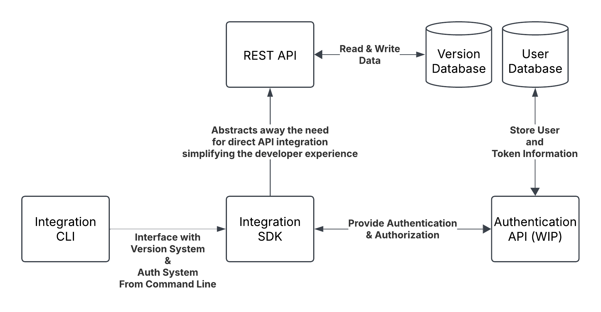
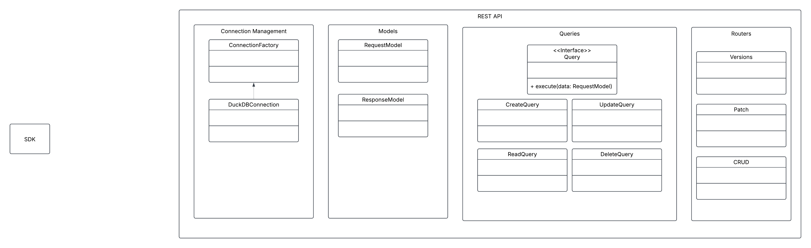
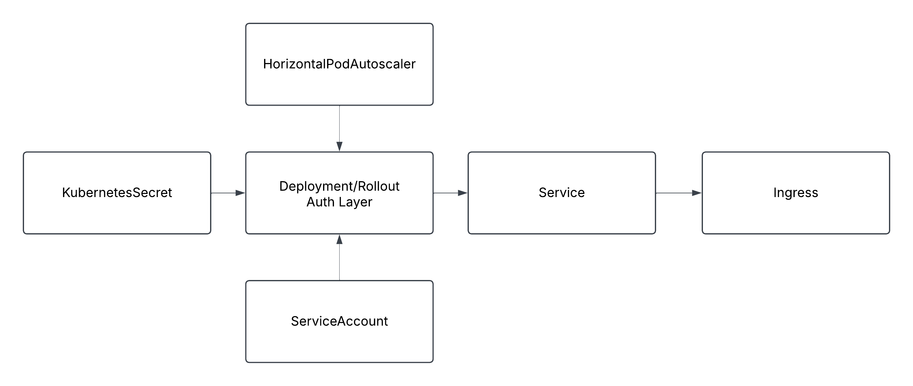

# lavs - lowercase acronym versioning system

WIP - Do not use at this time. Will have support in a robust fashion for DuckDB, MySQL, Postgres and SQL Server (maybe MongoDB) when it is ready.

## About

The ability to version software is very important. This is regardless of whether the software is a traditional monolith or it is a collection of microservices and micro-apps/frontends, each with its own independently evolving version. Often, as software solutions scale, or need to scale, they have disparate build stages that are not in a single contiguous pipeline. So, there becomes a need to have a single version integrated across multiple pipelines. To do so an external system is needed, this is just such a system. lavs is just such a system.

You may be asking why, but the why is rather simple - the ability to scale complex software built from decoupled components. In a complex scenario you can see things similar to the following - and indeed I have seen situations that are even more complex that below:
1. Application creates many different libraries
2. Libraries are used to create CLIs, Microservices, User Interfaces, etc..
3. The deployment 

While any sane human would realize that these do not have the same version - there seems to be a tendency to try and tie a product's version to all the underlying components unnaturally - that is, forcing them to have the same version! 

Furthermore, this is a starting step to a bigger picture to help track complex applications with different versions so that a sane version of a product version can be created. This will be great help in marketing, sales and identifying a release package whether managed internally or external in a client/customers software solution.

## The Architecture
From a functional standpoint - this is just a simple REST API with an optional authentication layer.

## Software Design/Architecture (WIP)

## The Deployment (WIP)
