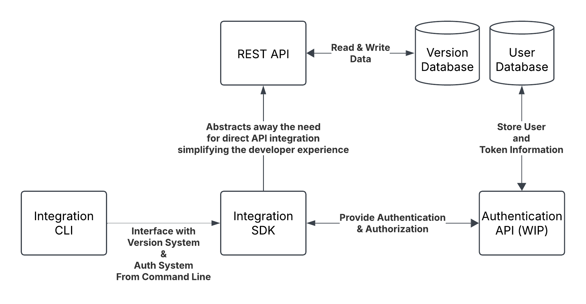
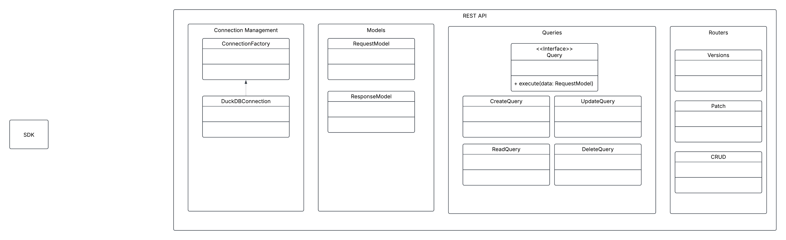
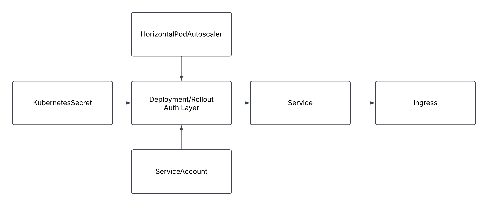

# lavs - lowercase acronym versioning system

**v1.0** — the open-source edition. Runs on DuckDB (local default) and PostgreSQL (production), with the identical API on both; MySQL and SQL Server (maybe MongoDB) are planned follow-ons. The managed-identity Enterprise edition ships separately as a private overlay (`lavs-ee`) that plugs in through the `lavs.plugins` extension seam — this repository contains the OSS edition only.

## About

The ability to version software is very important. This is regardless of whether the software is a traditional monolith or it is a collection of microservices and micro-apps/frontends, each with its own independently evolving version. Often, as software solutions scale, or need to scale, they have disparate build stages that are not in a single contiguous pipeline. So, there becomes a need to have a single version integrated across multiple pipelines. To do so an external system is needed, this is just such a system. lavs is just such a system.

You may be asking why, but the why is rather simple - the ability to scale complex software built from decoupled components. In a complex scenario you can see things similar to the following - and indeed I have seen situations that are even more complex that below:
1. Application creates many different libraries
2. Libraries are used to create CLIs, Microservices, User Interfaces, etc..
3. The deployment 

While any sane human would realize that these do not have the same version - there seems to be a tendency to try and tie a product's version to all the underlying components unnaturally - that is, forcing them to have the same version! 

Furthermore, this is a starting step to a bigger picture to help track complex applications with different versions so that a sane version of a product version can be created. This will be great help in marketing, sales and identifying a release package whether managed internally or external in a client/customers software solution.

## Editions

lavs v1 ships as a REST API plus the Constellation UI, in two editions selected purely by deploy config:

- **OSS (default)** — password + session auth (signup, email verification, optional domain allow-list) and/or an `X-API-Key` for headless clients (`LAVS_AUTH_MODES=password,apikey`).
- **EE (fast-follow, shipped)** — managed identity via Stytch (email magic links + Google/GitHub OAuth) behind the same pluggable auth abstraction; enable with `LAVS_EDITION=ee` and `stytch` in `LAVS_AUTH_MODES`. To verify an EE deployment against a real Stytch tenant, follow the manual smoke procedure that ships with the EE distribution.

For operations, the API exposes `GET /health` (liveness) and `GET /ready` (readiness) — the targets for the Helm chart's probes — and `GET /meta`, which reports the running edition and enabled auth modes so clients render the right login.

## The Architecture
From a functional standpoint - this is just a simple REST API with an optional authentication layer.

## Software Design/Architecture (WIP)

## The Deployment (WIP)
