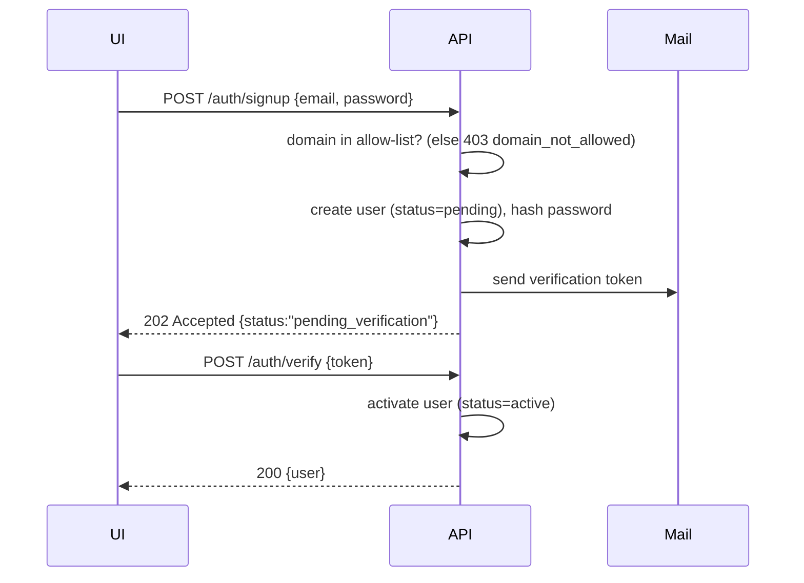
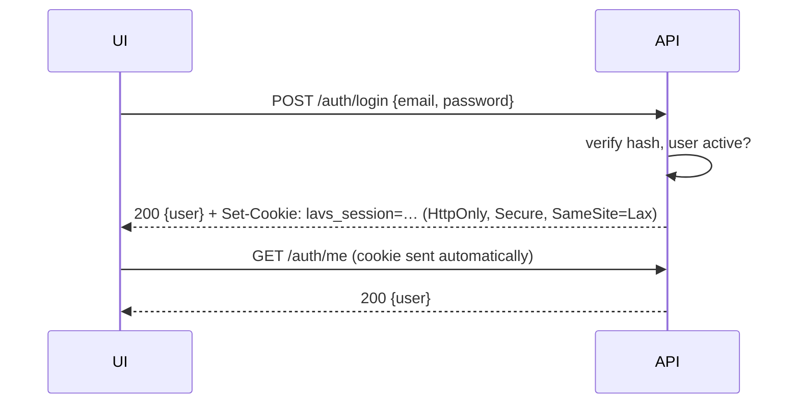
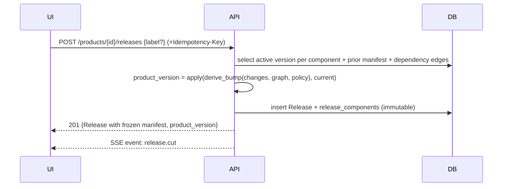
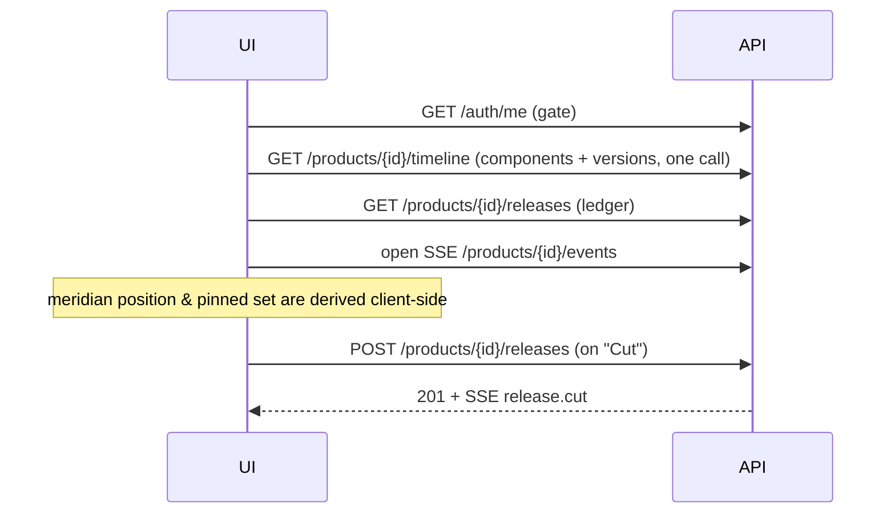

# LAVS — FE ↔ BE Contract & Integration Spec

The interface the **Constellation** UI and the LAVS backend both build against. If it isn't
here, the FE can't assume it. Companion to [ARCHITECTURE.md](./ARCHITECTURE.md) ·
[UI_CONCEPT.md](./UI_CONCEPT.md) · [ROADMAP.md](../planning/ROADMAP.md).

> **Decisions locked** (2026-06-24): **OSS is the first cut; EE is a fast-follow.** v1 auth =
> username/password + sessions (signup, email verification, domain allow-list) **and/or** API
> key by deploy config. **EE/Stytch shipped as the P6 fast-follow** — the provider abstraction
> carried it without any resource-route change. Product version on cut = **server auto-increment**.
> Stream freshness = **live (SSE)**.

---

## 1. Editions & auth model

LAVS ships in two editions; **auth is pluggable and selected by deployment config** (env
`LAVS_AUTH_MODES`, a comma list). One or more providers may be enabled at once. **v1 ships
OSS by default; EE landed as the P6 fast-follow** — `StytchProvider` slots behind the same
abstraction and is honored only when `LAVS_EDITION=ee`.

| | OSS (v1) | EE (later) |
|---|---|---|
| Password + sessions | ✅ signup, email verification, domain allow-list | ✅ (or delegated to Stytch) |
| API key (headless/deploy) | ✅ `X-API-Key` | ✅ |
| Managed identity | — | ✅ **Stytch** (magic links + OAuth via the prebuilt widget; P6) |
| Config flag | `LAVS_AUTH_MODES=password,apikey` | `LAVS_AUTH_MODES=stytch,apikey` |

### Provider abstraction (backend)

```
AuthProvider:
    authenticate(request) -> Principal | raises 401
Principal = { kind: "user" | "service", id, email?, edition }
```

Implementations: `PasswordSessionProvider`, `ApiKeyProvider` (wraps the existing
[api_key.py](../../app/security/api_key.py)), `StytchProvider`. The request passes if **any**
enabled provider authenticates it. A FastAPI dependency resolves the `Principal` and injects
it into routes (this supersedes the bare-key wiring in P0).

### Authorization (v1)

Authenticated ⇒ allowed. RBAC (org/role scoping) is a **future** item; endpoints are
designed to accept it later (every resource is owned by a product, products by an org).

## 2. Auth flows

### OSS signup + email/domain verification



### OSS login (session cookie)



- Session: opaque server-side session keyed by an `HttpOnly` cookie. `POST /auth/logout` clears it.
- **API key (headless):** clients send `X-API-Key: <key>`; no cookie, no session. Used by CI/pipelines and deploy-configured UIs.
- **EE / Stytch (shipped, P6):** UI uses the Stytch SDK; backend verifies the Stytch session JWT on `POST /auth/stytch/callback` and issues its own `lavs_session`. The rest of the API is identical regardless of how the `Principal` was obtained — which is exactly why EE can be added later without touching resource routes.

### Auth endpoints

| Method | Path | Body | Notes |
|--------|------|------|-------|
| POST | `/auth/signup` | `{email, password}` | OSS; 403 if domain not allowed; 409 if exists |
| POST | `/auth/verify` | `{token}` | activates a pending user |
| POST | `/auth/login` | `{email, password}` | sets session cookie |
| POST | `/auth/logout` | — | clears session |
| GET | `/auth/me` | — | current principal; 401 if unauthenticated |
| POST | `/auth/stytch/callback` | `{stytch_token}` | EE only — shipped (P6); generic 401 when `stytch` mode is disabled |

## 3. Resource endpoints

All resource routes require an authenticated `Principal`. Bodies are **JSON** (the current
query-param style is replaced). IDs are UUID strings.

| Method | Path | Purpose |
|--------|------|---------|
| GET | `/products` | list products |
| POST | `/products` | create `{name, description?}` |
| GET | `/products/{id}` | one product |
| GET | `/products/{id}/timeline` | **composite**: product + components + their versions (one call for the Constellation view) |
| GET | `/products/{id}/components` | list components |
| POST | `/components` | create `{product_id, name, kind}` (`kind`: library\|service\|ui\|cli) |
| GET | `/components/{id}/versions` | version history (immutable) |
| POST | `/versions` | create `{component_id, version, prerelease?}` |
| POST | `/versions/{id}/rollback` | mark `rolled_back`, re-activate previous (no delete) |
| GET | `/products/{id}/releases` | release ledger |
| POST | `/products/{id}/releases` | **cut a release** (see §5) |
| GET | `/releases/{id}` | a release + frozen manifest |
| GET | `/products/{id}/graph` | dependency graph — nodes (components) + edges (P9, see §10) |
| POST | `/products/{id}/dependencies` | add a dependency edge `{from_component_id, to_component_id}` (P9) |
| DELETE | `/products/{id}/dependencies?from=&to=` | remove a dependency edge (P9) |
| GET | `/products/{id}/impact?component=` | what-if: dependents a hypothetical major change would impact (P9) |
| GET | `/products/{id}/events` | **SSE** live stream (see §6) |
| GET | `/health` · `/ready` | liveness / readiness (Helm probes) |

### Core schemas

```jsonc
// Product
{ "id": "uuid", "name": "Aurora Platform", "description": "…", "created_at": "ISO-8601" }

// Component
{ "id": "uuid", "product_id": "uuid", "name": "lavs-api", "kind": "service" }

// Version (immutable)
{ "id": "uuid", "component_id": "uuid",
  "major": 2, "minor": 4, "patch": 0, "prerelease": null,
  "status": "active",            // active | superseded | rolled_back
  "created_at": "ISO-8601" }

// Release (frozen)
{ "id": "uuid", "product_id": "uuid",
  "product_version": "5.1.0",    // server-assigned, see §5
  "label": "Aurora 5.1",         // optional human label
  "created_at": "ISO-8601",
  "bump_level": "minor",         // P9: derived bump — major|minor|patch|none (null on pre-P9 rows)
  "bump_rationale": "{…}",       // P9: JSON explaining the derivation (null under the legacy policy)
  "components": [
    { "component_id": "uuid", "name": "lavs-api", "version_id": "uuid", "version": "2.4.0",
      "change_level": "minor" }  // P9: this component's own change vs the prior manifest (null under legacy)
  ] }

// Dependency edge (P9) — "from depends on to"
{ "id": "uuid", "product_id": "uuid",
  "from_component_id": "uuid", "to_component_id": "uuid", "created_at": "ISO-8601" }

// Graph (P9) — GET /products/{id}/graph
{ "product_id": "uuid", "nodes": [ …Component ], "edges": [ …Dependency ] }

// Impact (P9) — GET /products/{id}/impact?component=X
{ "component_id": "uuid",
  "impacted": [ { "component_id": "uuid", "projected_change_level": "minor" } ] }

// timeline (composite response for the Constellation view)
{ "product": { …Product },
  "components": [ { …Component, "versions": [ …Version ] } ] }
```

### Error model (uniform)

```jsonc
{ "error": { "code": "validation_error", "message": "human readable", "details": { … } } }
```

| HTTP | code | when |
|------|------|------|
| 401 | `unauthorized` | no/invalid credential |
| 403 | `forbidden` / `domain_not_allowed` | not permitted |
| 404 | `not_found` | unknown id |
| 409 | `conflict` | duplicate (name, email, etc.); P9 dependency edge that is a self-edge, cross-product, duplicate, or would form a cycle |
| 422 | `validation_error` | bad body (e.g. non-semver version) |

## 4. Version semantics

- Versions are **append-only and immutable**; `version` must match `^\d+\.\d+\.\d+$`
  (optionally `-prerelease`). Server rejects others with `422 validation_error`.
- "Patch" is just a new version with `patch+1` on the same component — no special table.
- **Rollback** (`POST /versions/{id}/rollback`) sets the current `active` version to
  `rolled_back` and re-activates the prior version. History is never deleted.

## 5. Cut Release — the write that matters

`POST /products/{id}/releases`

```jsonc
// request — NO version, NO manifest (server owns both)
{ "label": "Aurora 5.1", "notes": "optional" }
// optional header: Idempotency-Key: <uuid>   (prevents double-cut)
```

Server behavior:
1. Snapshot each component's current **`active`** version.
2. **Derive** the product version (server-owned; the client **cannot** set it). The bump is
   chosen by the product's `bump_policy` (P9):
   - `legacy` — an unconditional **minor** bump (the pre-P9 behaviour; existing products
     default to this).
   - `default` — classify each component's change against the previous release manifest
     (`major`/`minor`/`patch`/`none`), propagate along the intra-product dependency graph,
     and take the graph-wide maximum. A cut with **no material change derives `none`** and
     repeats the current version (a distinct release row is still recorded). New products
     use this policy.
   The derived `bump_level`, a JSON `bump_rationale`, and each component's `change_level`
   are recorded on the release.
3. Persist an immutable `Release` + `release_components` pinning the exact `version_id`s.
4. Emit a `release.cut` event on the SSE stream (§6), carrying `bump_level`.



Because versions are immutable and the release pins `version_id`s, **a cut release never
changes** even if components ship new versions or get rolled back afterward — it's a
permanent, reproducible statement of the product composition.

## 6. Live updates (SSE)

`GET /products/{id}/events` — `text/event-stream`. Server→client only; all writes stay REST.
(WebSocket is a possible future upgrade if bidirectional needs appear; SSE is sufficient now.)

```jsonc
event: version.created
data: { "component_id":"uuid", "version": { …Version } }

event: version.rolled_back
data: { "component_id":"uuid", "version_id":"uuid", "reactivated_version_id":"uuid" }

event: release.cut
data: { "release": { …Release } }          // carries the derived bump_level (P9)

event: dependency.added
data: { "dependency": { …Dependency } }    // P9

event: dependency.removed
data: { "dependency": { "id":"uuid", "product_id":"uuid",
                        "from_component_id":"uuid", "to_component_id":"uuid" } }  // P9
```

FE handling: append a new **star** on `version.created`, dim/strike on `version.rolled_back`,
add a **ledger** entry on `release.cut`. The meridian + product-version derivation remain a
pure **client-side projection** over this data.

## 7. The Constellation view's data lifecycle



## 8. Cross-cutting / config

- **Base URL:** FE reads `VITE_LAVS_API_URL`; one build runs against any backend.
- **CORS:** backend allow-list (`LAVS_CORS_ORIGINS`); credentials enabled for the session cookie.
- **Environments:** identical API on **DuckDB (local/default)** and **PostgreSQL (prod)**.
- **Edition flag:** `GET /meta` (public) reports `edition` + enabled `auth_modes` (+ the EE publishable `stytch_public_token`) so
  the UI renders the right login (password form vs Stytch widget vs "configured key").
- **API versioning:** prefix `/// v1` once contracts stabilize.

## 9. Open items

- Domain allow-list source (env list vs DB-managed) and email-send transport.
- Session store backend (in-DuckDB vs Redis) for multi-replica prod.
- Idempotency-Key retention window.
- Org/RBAC model (deferred) — how products map to orgs/teams.
- Whether `/products/{id}/timeline` needs pagination for very long histories.

## 10. Dependency graph & derived versions (P9)

A product's components can be wired into an **intra-product dependency graph** — a DAG whose
edge `from → to` reads "`from` depends on `to`". The graph drives how a release's version is
*derived* (§5) and powers an impact what-if.

- **Edges** — `POST /products/{id}/dependencies` `{from_component_id, to_component_id}` (201,
  returns the edge). `DELETE /products/{id}/dependencies?from=&to=` (204). Rejected with
  **409** when the edge is a self-edge, crosses product boundaries, already exists, or would
  introduce a **cycle**; **404** for an unknown product or component. Cycle rejection is done
  in the app layer (portable across all four backends — no recursive CTE).
- **Graph** — `GET /products/{id}/graph` → `{ product_id, nodes:[Component], edges:[Dependency] }`.
- **Impact** — `GET /products/{id}/impact?component=X` → the transitive dependents a
  hypothetical **major** change to `X` would touch, each with a `projected_change_level`.
- **Derivation & propagation** — at cut time each component's own change is classified against
  the previous manifest; a dependency's change contributes to its dependents under a
  **contraction** policy (a dependency's `major` lifts a dependent to at most `minor`). Because
  every dependency is itself a component already counted, the **product bump equals the maximum
  own-change** for an intra-product graph — edges shape per-component `change_level`,
  `bump_rationale`, and `/impact`, not the product version itself. Edge-driven cross-product
  versioning is the P10 (cross-product composition) direction.
- **Policy** — a product carries a `bump_policy` (`legacy` | `default`); see §5. There is no
  API to change it yet (deferred): existing products stay `legacy`, new products are `default`.

**Live updates:** `dependency.added` / `dependency.removed` SSE events (§6). As with all SSE
frames, they are notifications — the REST `GET /graph` remains the source of truth, so a client
that misses a frame re-syncs.
