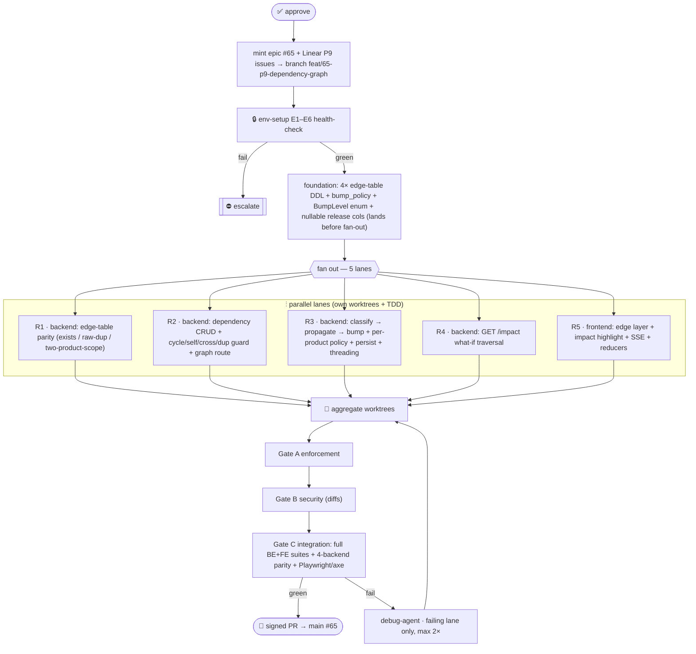

# P9 Product Dependency Graphs (intra-product DAG + change propagation) — Multiagent Parallel Execution Plan

> **Status:** Approved — in progress (2026-08-22). P9 replaces the blind minor-bump in `app/domain/product_version.py::next_product_version` with a per-component-diff bump derived at cut time: an intra-product component DAG (`component_dependencies`) plus a Python-side classifier + DAG walk that records each release's `bump_level`, `bump_rationale`, and per-component `change_level`. A per-product `bump_policy` column keeps every existing product on a `legacy` preset (byte-identical to today) while new products adopt the graph-derived `default` policy. Epic **#65** · branch `feat/65-p9-dependency-graph` off `main` @ `eea0171` · Linear *P9 — Dependency Graphs* **LAV-{a}..{b}** (env, foundation, R1..R5, gates A/B/C). No tags, no version bump, no GitHub Release — merge to `main` is the release.

P9 closes the gap between "we cut a release" and "we cut a *correct* release": today every cut is a minor bump regardless of what actually changed. P9 makes the version a *derived* fact — classify each component's real change against the previously-pinned manifest and take the graph-wide max — while the intra-product dependency edges drive per-component rationale, `change_level`, and a what-if `/impact` endpoint. A per-product `legacy` policy reproduces today's behaviour byte-for-byte, so existing products see zero change until an operator moves them onto the graph policy. **In P9 the DAG edges refine per-component signal and impact, not the product bump itself** (see §7a — the fixed policy is contraction-only, so for an intra-product graph the product bump equals the max own-change); propagation becomes load-bearing on the *version* only in P10, which lifts the same edge primitive to cross-product composition (outline only).

---

## 1. Conventions loaded

Re-read before fan-out: `.claude/conventions/core/general.md`, `.claude/conventions/languages/python.md`, `.claude/conventions/languages/typescript.md`, `docs/design/ARCHITECTURE.md`, `docs/design/API_CONTRACT.md`, `docs/planning/ROADMAP.md` §1–§5, `docs/planning/ENVIRONMENT.md`. Governing rules: Python 3.14 / uv / ruff / pyright(strict) · one-class-per-file · filename = `snake_case(class)` · `T | None` (no `Optional`) · no module/class constants → enum/pydantic-settings/YAML · raw **parameterized** SQL authored once with `?` placeholders (never dialect-specific), no ORM · interface-style ABCs · Conventional Commits with epic **#65** · signed commits · branch-first, read-before-write · **merging to `main` IS the release** (no tags, no version bump, pyproject stays `1.0.0`).

**Gaps flagged:**
- **G-P9a** — *Removed-component semantics.* A component in the prior manifest but absent from the active set classifies as **MAJOR** (breaking) and contributes at product scope. Additionally, an existing edge whose *dependency* endpoint was removed feeds `effective = MAJOR` through `P` to its dependents (G-P9h), so a breaking removal marks its dependents impacted. Decision fixed below.
- **G-P9b** — *Newly-added component.* Present now, absent from prior manifest → **MINOR** (feature addition). The first-ever release (all nodes "added") therefore falls out to product MINOR of `base_version`, matching legacy's `0.0.0 → 0.1.0`.
- **G-P9c** — *Prerelease-only diff.* `major.minor.patch` equal, `prerelease` differs → **PATCH**. Bump paths drop `-prerelease` from `current` (existing `_parse_core` behaviour), preserved for legacy equivalence.
- **G-P9d** — *NONE bump.* A re-cut with zero material change yields `bump_level = NONE` and `product_version == current` (string unchanged, release still recorded). Only reachable after the first release. No downstream consumer keys on `(product_id, product_version)` uniqueness (idempotency replay, "latest release", and the `release.cut` payload all disambiguate by `id`/`created_at`), so duplicate-version releases are safe by design.
- **G-P9e** — *Policy selection.* P9 ships **one built-in `default` policy + a `legacy` preset**, selected by a stored per-product `products.bump_policy` column (existing rows → `legacy` via column DEFAULT; new products insert `default`). This is the minimal reconciliation of FIXED decision 4 (existing products unchanged) with acceptance #3 (graph-derived bump runs for new work). The **pluggable policy interface and any per-request caller-supplied selector remain DEFERRED** (no new field on `CutReleaseRequest`/`cut_release_model.py`).
- **G-P9f** — *`bump_level`/`bump_rationale`/`change_level` columns nullable* so pre-P9 immutable releases still read back (old rows NULL); response fields are `str | None`.
- **G-P9g** — *Regression / downgrade.* A backward move (e.g. `2.0.0 → 1.0.0`) is classified by the **highest differing position regardless of direction** (major-position change → MAJOR, etc.). A rollback is a deliberate material change and therefore bumps the product; pinned by the classifier table test rather than left to an equality accident.
- **G-P9h** — *Dangling / inactive edge endpoint.* An edge whose dependency endpoint has no active version (removed since the prior manifest) is **not** dropped; its `effective` is defined as **MAJOR** and fed through `P` to dependents. This makes `effective()` total over all loaded edges (no `KeyError` in rationale/impact) and keeps removal-breakage propagating to dependents.
- **G1** (mutation testing unwired) and **G2** (`app/` vs config `backend/api` path drift) — carried, unchanged, documented.

## 2. Agent roster → P9 roles

Orchestration = harness · env-runner = `devops-agent` · foundation = `architect-agent` + `backend-agent` (edge table + `products.bump_policy` + `BumpLevel` enum + nullable release columns before fan-out) · **R1** `backend-agent` (edge-table parity, raw-insert discriminators) · **R2** `backend-agent` (dependency CRUD + Python cycle/self/cross/dup guards + graph route) · **R3** `backend-agent` (derivation: classifier → propagation → bump, per-product policy dispatch, persistence, response threading on cut **and** read paths) · **R4** `backend-agent` (impact what-if endpoint) · **R5** `frontend-agent` (edge render + impact highlight + SSE) · docs = `document-agent`. Gate A = `enforcement-agent` · Gate B = `security-agent` (diff-scoped) · Gate C = `review-agent` (integration, full suites + 4-backend parity + Playwright/axe). `debug-agent` on failing lane only, max 2×.

**Unused this phase:** performance/data/compliance/observability/incident/migration/mlai/product/plan/explain/ask/refactor — no gap, no role unfilled (the schema change needs no `BackendKind`/`BackendFactory`/`Backend`-subclass work per the persistence grounding).

## 3. Environment manifest (hard prerequisite gate)

`env-setup` (devops) stands up + health-checks **before** any lane, appends a `P9_ENV_READY` block to `ENVIRONMENT.md`, and owns start/stop of all infra.

| # | Item | Health check | Notes |
|---|---|---|---|
| E1 | BE baseline | `uv run pytest -q` green @ `67c599e` (466 BE); `ruff check`, `ruff format --check`, `pyright app` clean | pre-change baseline |
| E2 | FE baseline | `pnpm typecheck && pnpm lint && pnpm test && pnpm build` green (118 FE) | pre-change baseline |
| E3 | 4-backend parity | testcontainers up: `postgres:17-alpine`, `mysql:8.4`, `mcr.microsoft.com/mssql/server:2022-latest`; `tests/backends/` green; `_containers_unavailable()` must NOT fire under `CI` | parity cannot skip in CI |
| E4 | e2e / a11y | `pnpm e2e` (Playwright, axe-core) green on `/login` + `/`, ≤10 min, vite preview on `127.0.0.1` | only a11y gate |
| E5 | audits | `pip-audit --strict` (exported non-dev locked deps) + `pnpm audit --prod --audit-level high` clean | blocking CI jobs |
| E6 | add-column-to-existing-table | on a **pre-seeded** MySQL 8.4 + MSSQL 2022 volume (releases/release_components/products already created), `init_schema` adds `bump_level`/`bump_rationale`/`change_level`/`bump_policy` idempotently and a subsequent P9 INSERT succeeds | guards the real upgrade path the fresh-container F-3 test cannot (see §7b) |

Any hard failure ⇒ escalate before fan-out; the pipeline owns all infra (starts/stops).

## 4. Scope

**In:**
- `component_dependencies` edge table (product-scoped, unique `(product_id, from_component_id, to_component_id)`, surrogate ULID id) across all four dialect DDLs + `database.yaml` manifest entry (after `components`).
- `products.bump_policy` column (`legacy`/`default`, DEFAULT `legacy`) added idempotently across all four dialects; new-product creation writes `default`.
- Application-side cycle rejection, self-edge rejection, cross-product rejection, duplicate rejection — in a new `app/queries/component_dependencies/` `Query[T]` lane. **No recursive CTEs.**
- Dependency CRUD + read endpoints on the existing `products.py` router: `POST`/`DELETE /products/{id}/dependencies`, `GET /products/{id}/graph`, `GET /products/{id}/impact`.
- New `BumpLevel` StrEnum; pure domain classifier + propagation; `bump_major`/`bump_patch`/`none` paths in `product_version.py`; per-product policy dispatch swapped in at `cut_release_query.py` line 116.
- Persist `releases.bump_level`, `releases.bump_rationale`, `release_components.change_level`; thread through **all three** response constructors — the cut mapper (`release_manifest_mapper.py`), the read mapper (`releases_read/release_response_mapper.py::to_model`), and the per-component change_level path in `ReleaseManifestReader` — plus the read-query SELECTs.
- `legacy` preset = unconditional MINOR, byte-identical to today; existing products pinned to it on upgrade.
- SSE `dependency.added` / `dependency.removed`; `bump_level` on `release.cut` payload.
- Constellation edge layer + impact highlight; FE types, SSE client, reducers, tests.
- `API_CONTRACT.md`, `ROADMAP.md` (§1/§2 v2 reconciliation, §3 row + gantt + §4 detail), `ENVIRONMENT.md`.

**Out (deferred):** pluggable policy *interface* + per-request caller-supplied policy selector (P9 ships two server-side presets selected by a stored per-product column, G-P9e) · cross-product edges / cross-product composition (P10) · any recursive-CTE reachability · dependency-mutation event *replay*/re-sync beyond the existing best-effort bus.

> **Cadence note:** P9 is deliberately the largest phase to date — it bundles a new table across four dialects, a full guarded query lane, a derivation engine that rewrites the core product-version arithmetic, persistence threading through the cut **and** both read paths, three new endpoints plus one changed, and a complete frontend edge/impact/SSE surface. R3 and R5 each approach a full phase. It exceeds the ROADMAP's ~2-week indicative cadence; the §3 gantt entry reflects a longer bar (see §"ROADMAP.md updates"). If the pipeline stalls, the natural fault line is edge-table + CRUD + `/graph` (P9a) vs derivation + persistence + `/impact` + FE (P9b); this is flagged, not pre-split.

## 5. Execution map



**Dependency declaration:** lanes fan out only after env-setup **and** the foundation commit (edge table + `bump_policy` across all 4 DDLs + `BumpLevel` enum + nullable release columns) — R2/R3/R4 consume that schema+enum. Gates run A→B→C sequentially; debug re-enters at aggregation on the failing lane only.

## 6. Subagent specification

- **env-setup** (devops): E1–E6 + append `P9_ENV_READY` to `ENVIRONMENT.md`; documents container start/stop. E6 exercises the add-column-to-existing-table path on MySQL+MSSQL.
- **foundation** (architect+backend): adds `component_dependencies` CREATE to all four `app/database/{duckdb,postgres,mysql,mssql}/ddl.sql`; adds the `database.yaml` entry after `components`; adds `app/models/enums/bump_level.py` (`BumpLevel(StrEnum)`: `none`/`patch`/`minor`/`major`) modeled on `version_status.py`; adds idempotent column migrations for `releases.bump_level`/`bump_rationale`, `release_components.change_level`, and `products.bump_policy` on **all four** dialects (DuckDB/PG via `ADD COLUMN IF NOT EXISTS`; MySQL via `information_schema.columns` probe → conditional `ALTER`; MSSQL via `COL_LENGTH(...) IS NULL` guard → `ALTER` — see §7b). Outputs: green `create_tables()` existence assertion on all four backends.
- **R1** (backend): owns `tests/backends/test_component_dependencies_parity.py` (new file, own helpers, reuses `pg_env`/`mysql_env`/`mssql_env` unchanged). **Raw-parameterized-INSERT** discriminators that bypass the R2 Python guard so the DB constraint actually fires (see §7). Cycle/self/cross rejection live as DB-free unit tests, not in the parity file.
- **R2** (backend): owns `app/queries/component_dependencies/` (`add_dependency_query.py`, `remove_dependency_query.py`, `list_dependencies_query.py` / graph, `*_request.py`), the Python reachability cycle-check, and the `products.py` routes. `?`-placeholder SQL only, ULID edge id via `new_ulid()`. Raises typed `ConflictError`/`NotFoundError`.
- **R3** (backend): owns `app/domain/product_version.py` (add `bump_major`/`bump_patch`/`none`, generalize `next_product_version` to accept `bump_level`), new pure `app/domain/change_classifier.py` + `app/domain/bump_propagation.py`, the per-product policy dispatch swapped in at `cut_release_query.py` L116 (read `products.bump_policy`; `legacy` → unconditional MINOR, `default` → graph derivation), persistence (`_INSERT_RELEASE`/`_INSERT_RELEASE_COMPONENT` + reads), and response threading in **all three** constructors: `release_manifest_mapper.py` (cut), `releases_read/release_response_mapper.py::to_model` (read — extend the 6-tuple unpack + `_RELEASES_SELECT`/`_RELEASE_SELECT` in `list_releases_by_product_query.py` and `get_release_by_id_query.py`), and `ReleaseManifestReader._MANIFEST_SELECT` (per-component `change_level`).
- **R4** (backend): owns `GET /impact` query + mapper (read-only what-if over the propagation function).
- **R5** (frontend): owns `constellation-view.tsx` edge layer, `geometry.ts` endpoints, `station.tsx` impact aria, `domain.ts` types, `api/events.ts`, `use-product-events.ts`, `event-cache.ts`, `mocks/handlers.ts` + tests.
- **Gates/debug:** enforcement (A), security-on-diffs (B), integration (C, includes parity + Playwright), debug retries failing lane max 2×.

## 7. Test strategy

ATDD first — each lane's acceptance stated as an executable scenario, red until the lane lands, gating at Gate C. TDD in-lane (AAA, mirrored placement, `unittest.mock`; skills `test-aaa-structure`, `test-mocking-rules`, `test-coverage-categories`). Every new test must fail without its fix; coverage top-ups must be meaningful (a >5pt shortfall escalates rather than gets padded).

**The derivation is pure and DB-free** — classifier + propagation take already-fetched row tuples, never a connection, so they unit-test without a DB.

**Discriminating parity asserts (R1) — raw inserts that reach the engine.** A single valid insert through the guarded R2 lane does **not** discriminate, and neither does an R2-routed duplicate (the Python pre-check raises `ConflictError` before the DB ever executes the second INSERT, so the DDL `UNIQUE` and its exact key columns are never exercised). The parity file therefore issues **raw parameterized INSERTs that bypass R2's guard**, and asserts, on each real backend:
1. `component_dependencies` **exists** after `init_schema` (catches a forgotten/broken dialect file — missing MSSQL `OBJECT_ID` guard, missing MySQL `VARCHAR(255)`, inline-vs-table-level FK);
2. a raw insert of a valid edge followed by a raw insert of a **duplicate** `(product_id, from, to)` **raises** at the engine (catches a `UNIQUE` omitted in one dialect, or an unindexable unbounded VARCHAR on MySQL/MSSQL);
3. raw inserts of the **same `from`/`to` under two different `product_id`s both succeed** (catches a unique key that dropped `product_id` — if it were dropped, the second raw insert would raise).

The plan states explicitly that discriminators (2) and (3) do **not** route through the guarded query lane. Cycle / self-edge / cross-product rejection are **DB-free unit tests** (pure Python reachability, identical on all four backends), kept out of the parity file to keep the non-skippable suite lean within the ≤10-min budget.

**Product-bump invariance (R3, new — makes the promise match the math).** A test asserts that for an intra-product graph the resulting `product_version` is **invariant to edge presence**: cutting the §7a active-vs-prior state with the full edge set and with `component_dependencies` emptied yields byte-identical `product_version` (edges move only per-component `change_level`/`rationale` and `/impact`). This encodes §7a's contraction property and prevents the plan's narrative from over-claiming.

**Legacy-equivalence (R3).** A property/table test asserts that under the `legacy` policy the L116 result is byte-identical to `bump_minor(current)` for every `(latest_version, base_version)` pair including the never-released `base_version` fallback (`0.0.0 → 0.1.0`) and prerelease-dropping inputs. A companion test asserts an **existing product with an empty edge set on `bump_policy='legacy'` produces exactly today's minor bump**, and a **new product on `bump_policy='default'` with an empty edge set produces the diff-derived bump** (PATCH/MINOR/MAJOR/NONE per own-changes) — pinning G-P9e's reconciliation of decisions 3 and 4.

**Classifier table test (R3)** covers own-level: added (MINOR), removed (MAJOR), prerelease-only (PATCH), none, and **regression** (backward move classified by highest differing position, G-P9g). **Propagation test** includes an edge pointing at a **removed** dependency endpoint, asserting `P(MAJOR)=MINOR` reaches the dependent (G-P9h) with no `KeyError`, plus a diamond to assert termination.

Backend gate: `uv run pytest -q --cov=app --cov-report=term-missing`, enforced L80/B70 (`fail_under=80`, branch=true); F90 report-only. **Do not** wire `--cov` into addopts. Frontend gate: vitest L80/B70/F90/S85; Playwright/axe zero serious/critical on `/login` + `/` within the 10-min cap.

## 7a. Derivation model (unambiguous)

**Levels & ordering.** `BumpLevel`: `NONE=0 < PATCH=1 < MINOR=2 < MAJOR=3`. `max` is over this ordinal. **The identity of an empty max is `NONE`** (a node with no outgoing edges, or the degenerate empty-graph product max). A zero-active-component cut is already rejected upstream by the existing `active_rows == 0 → ConflictError` guard, so the product-scope empty max is unreachable by construction — G-P9d's "NONE only after the first release" holds.

**Edge direction.** An edge `A → B` means *"A depends on B"* (`from_component_id=A`, `to_component_id=B`). Change propagates **from dependency B to dependent A**.

**Step 1 — leaf (own) classification.** For each active component `c`, compare its ACTIVE `(major, minor, patch, prerelease)` to the tuple pinned for the same `component_id` in the **previous release manifest** (the latest release by `created_at DESC, id DESC` — same ordering as `_SELECT_LATEST_RELEASE_VERSION`; the lookup must also fetch that release's `id` to load its manifest via `_SELECT_RELEASE_MANIFEST`, and must read the **raw** version columns, never the pre-rendered `version` string):

```
own(c):
  no prior row for c            -> MINOR   # newly added (G-P9b)
  major differs                 -> MAJOR   # incl. backward, e.g. 2->1 (G-P9g)
  else minor differs            -> MINOR
  else patch differs            -> PATCH
  else prerelease differs       -> PATCH   # prerelease-only churn (G-P9c)
  else                          -> NONE
```

Comparison is by *position that differs, not direction*: a rollback classifies by its highest differing position and is a deliberate material bump (G-P9g).

**Step 2 — propagation contribution.** A dependency's *effective* level contributes to its dependent through `P`:

```
P(NONE)  = NONE
P(PATCH) = PATCH
P(MINOR) = PATCH
P(MAJOR) = MINOR   # a dependency MAJOR lifts dependents to at least MINOR
```

**Step 3 — effective level over the DAG.** Process nodes so that for every edge `A → B`, `B` is computed before `A` (topological sort done **in Python** over edges loaded with `?` placeholders — no recursive CTE). `effective()` is **total over every loaded edge**: an endpoint with no active version (removed since the prior manifest) is assigned `effective = MAJOR` (G-P9h), so no lookup is undefined.

```
effective(c) = max( own(c),  max over edges c → d of  P(effective(d)) )      # empty max = NONE
```

Because `effective` is defined over dependencies' *effective* (not own) levels, per-node signal is transitive.

**Step 4 — product bump.**

```
product_bump = max(
    max over active c of effective(c),
    MAJOR if any component was REMOVED since the prior manifest else NONE   # G-P9a
)
```

**Contraction property (why edges do not move the product bump in P9).** The fixed policy is contraction-only: `P(x) ≤ x` for every level. By induction over the topological order, `effective(c) ≤ max own-level in c's dependency subtree`. In an **intra-product** graph every dependency endpoint is itself an active component whose own level already appears in `max over active c of own(c)`. Therefore

```
max_c effective(c) == max_c own(c)      (for an intra-product graph)
```

and `product_bump == max( max_c own(c), MAJOR-if-removed )`. **In P9 the DAG edges influence per-component `effective`/`change_level`/`rationale` and the `/impact` endpoint — not the product version.** Deleting `component_dependencies` entirely yields byte-identical product versions for all intra-product inputs (pinned by the R3 invariance test). Propagation becomes load-bearing on the *version* only in P10, where a backing product's `bump_level` is **not** already an active node in the max.

**Step 5 — apply to current.** `current = latest_release_version if it exists else base_version`, then:

```
MAJOR -> f"{maj+1}.0.0"
MINOR -> f"{maj}.{min+1}.0"
PATCH -> f"{maj}.{min}.{patch+1}"
NONE  -> current   # version string unchanged (G-P9d)
```

All bump paths drop any `-prerelease` on `current` (existing `_parse_core` behaviour), preserved for legacy equivalence.

**Policy dispatch (per product).** `cut_release_query.py` reads `products.bump_policy`:
- `legacy` → force `product_bump = MINOR` unconditionally (ignore the diff), keep the `current = latest or base` fallback, `bump_minor(current)`. Provably byte-identical to today for all inputs. Existing products upgrade pinned to `legacy` (column DEFAULT), so they see **no behaviour change**.
- `default` → the Step 1–5 derivation above. New products insert `bump_policy='default'`, so the graph-derived bump runs for all new work.

**Explainability.** The release records `bump_level = product_bump` and a `bump_rationale` JSON: per-component `{own, effective}` plus the dominating node/edge (the component(s) whose level determined the product max). Each `release_components` row records `change_level = own(c)`.

### Worked edge cases

Graph: `API → Core`, `CLI → API`, `Docs` (no edges). Active vs prior:

| component | prior→active | own | effective |
|---|---|---|---|
| Core | 1.2.0 → 2.0.0 | MAJOR | MAJOR |
| API | 3.4.1 → 3.4.1 | NONE | `max(NONE, P(MAJOR)=MINOR)` = **MINOR** |
| CLI | 0.9.0 → 0.9.0 | NONE | `max(NONE, P(MINOR)=PATCH)` = **PATCH** |
| Docs | 1.0.0 → 1.0.1 | PATCH | PATCH |

`product_bump = max( max own = MAJOR (Core), removed = NONE ) = MAJOR`; dominating node = **Core, from its OWN MAJOR change** — not from propagation. `current 5.1.0 → 6.0.0`. The edges explain *why* API and CLI carry `effective` MINOR/PATCH (used by `/impact` and the rationale), but **the product MAJOR holds even if the edges are deleted**: the version is driven by Core's own change. This is the honest reading of the contraction property above.

- **First-ever release (no prior manifest):** every active component has no prior row → `own = MINOR` for all → `product_bump = MINOR`, applied to `base_version`. `0.0.0 → 0.1.0`, identical to legacy's first cut. ✅
- **Component removed since last release:** in prior manifest, not in active set → contributes **MAJOR** at product scope (G-P9a); any surviving edge into it feeds `P(MAJOR)=MINOR` to its dependents (G-P9h). If removal is the only change, product = MAJOR.
- **Newly-added component:** in active set, not in prior → `own = MINOR` (G-P9b); its `effective` feeds `P(MINOR)=PATCH` to dependents (rationale/impact only).
- **Prerelease-only diff:** `3.4.1 → 3.4.1-rc.2` → `own = PATCH` (G-P9c); the bump drops the `-rc.2` from `current`.
- **Regression:** `2.5.3 → 2.5.1` → `own = PATCH`; `2.0.0 → 1.0.0` → `own = MAJOR` (G-P9g) — a deliberate material bump.
- **Zero-change re-cut:** all `own = NONE`, no edges lift anything → `product_bump = NONE` → `product_version == current` (G-P9d); a second release row is recorded sharing the version, disambiguated by `id`/`created_at`.
- **Cycle attempt:** inserting `Core → CLI` when `CLI ⇝ Core` already exists (via `CLI → API → Core`) is rejected at insert time by the Python reachability check (reachable-from-`to` reaches `from`) → `ConflictError` 409. The DAG invariant holds, so Step 3's topological sort always terminates.

## 7b. Schema changes

Four dialect files, each in its own idiom; `DdlScript` splits on `;` so **no interior `;`, no `;` in literals, `--` line comments only**. The edge table is brand-new ⇒ idempotent CREATE on all four (no ALTER needed). The `bump_level`/`bump_rationale`/`change_level`/`bump_policy` columns need **real idempotent column migrations on all four dialects**, because `releases`/`release_components`/`products` already exist on every backend (including MySQL/MSSQL) and a guarded CREATE would silently skip the new columns on a pre-P9 volume — and unlike `base_version`, the P9 INSERT **writes** these columns, so a missing column is a hard runtime INSERT failure, not a no-op.

**`app/database/duckdb/ddl.sql`** (and PG, TIMESTAMP, inline REFERENCES):
```sql
CREATE TABLE IF NOT EXISTS component_dependencies (
    id VARCHAR PRIMARY KEY,
    product_id VARCHAR NOT NULL REFERENCES products(id),
    from_component_id VARCHAR NOT NULL REFERENCES components(id),
    to_component_id VARCHAR NOT NULL REFERENCES components(id),
    created_at TIMESTAMP NOT NULL DEFAULT current_timestamp,
    UNIQUE (product_id, from_component_id, to_component_id)
);
```

**`app/database/mysql/ddl.sql`** — VARCHAR(255) on keyed/unique/FK cols, table-level FK, InnoDB, DATETIME (combined unique index = 3×255×4 = 3060 B, under the 3072 B InnoDB limit):
```sql
CREATE TABLE IF NOT EXISTS component_dependencies (
    id VARCHAR(255) NOT NULL,
    product_id VARCHAR(255) NOT NULL,
    from_component_id VARCHAR(255) NOT NULL,
    to_component_id VARCHAR(255) NOT NULL,
    created_at DATETIME NOT NULL DEFAULT CURRENT_TIMESTAMP,
    PRIMARY KEY (id),
    UNIQUE (product_id, from_component_id, to_component_id),
    FOREIGN KEY (product_id) REFERENCES products(id),
    FOREIGN KEY (from_component_id) REFERENCES components(id),
    FOREIGN KEY (to_component_id) REFERENCES components(id)
) ENGINE=InnoDB DEFAULT CHARSET=utf8mb4;
```

**`app/database/mssql/ddl.sql`** — `OBJECT_ID` guard (no `IF NOT EXISTS` on CREATE TABLE in T-SQL), single batch, no interior `;`:
```sql
IF OBJECT_ID(N'component_dependencies', N'U') IS NULL
CREATE TABLE component_dependencies (
    id VARCHAR(255) NOT NULL PRIMARY KEY,
    product_id VARCHAR(255) NOT NULL,
    from_component_id VARCHAR(255) NOT NULL,
    to_component_id VARCHAR(255) NOT NULL,
    created_at DATETIME2 NOT NULL DEFAULT SYSUTCDATETIME(),
    CONSTRAINT uq_component_dependencies UNIQUE (product_id, from_component_id, to_component_id),
    CONSTRAINT fk_cd_product FOREIGN KEY (product_id) REFERENCES products(id),
    CONSTRAINT fk_cd_from FOREIGN KEY (from_component_id) REFERENCES components(id),
    CONSTRAINT fk_cd_to FOREIGN KEY (to_component_id) REFERENCES components(id)
);
```

**Idempotent column migrations (all four dialects, real add-to-existing-table paths):**
- **DuckDB / PG:** `ALTER TABLE releases ADD COLUMN IF NOT EXISTS bump_level VARCHAR;` / `ADD COLUMN IF NOT EXISTS bump_rationale VARCHAR;`, `ALTER TABLE release_components ADD COLUMN IF NOT EXISTS change_level VARCHAR;`, `ALTER TABLE products ADD COLUMN IF NOT EXISTS bump_policy VARCHAR NOT NULL DEFAULT 'legacy';` (existing rows → `legacy`).
- **MySQL 8.4** (no `ADD COLUMN IF NOT EXISTS`): schema-qualified `information_schema.columns` probe then conditional `ALTER`, matching the schema-qualified-probe precedent from commit `fac5b30`. `bump_rationale` → `TEXT`; enum columns → `VARCHAR(255)`; `bump_policy VARCHAR(255) NOT NULL DEFAULT 'legacy'`.
- **MSSQL 2022:** `IF COL_LENGTH('releases','bump_level') IS NULL ALTER TABLE releases ADD bump_level VARCHAR(255);` (and siblings); `bump_rationale` → `NVARCHAR(MAX)`; `IF COL_LENGTH('products','bump_policy') IS NULL ALTER TABLE products ADD bump_policy VARCHAR(255) NOT NULL CONSTRAINT df_products_bump_policy DEFAULT 'legacy';`.

All release/component columns nullable (G-P9f). `bump_policy` is `NOT NULL DEFAULT 'legacy'` so existing products inherit today's behaviour automatically; new-product creation writes `default`. `database.yaml` gets a `component_dependencies` entry **after** `components` so reverse-order drop respects FKs; `create_tables()` asserts its existence. **E6 exercises the add-column-to-existing-table path on pre-seeded MySQL+MSSQL volumes** — the fresh-container F-3 idempotency test cannot detect a skipped column and would otherwise give false green.

**Manifest lookup gap:** `_SELECT_LATEST_RELEASE_VERSION` returns only the version string — extend it to also return the release `id` (or `SELECT id, product_version FROM releases … ORDER BY created_at DESC, id DESC LIMIT 1`) so the previous manifest can be loaded and diffed against **raw** version columns (never the pre-rendered `version` string, which loses the split parts).

**Cycle check (Python, portable):** the R2 lane loads existing product edges with `?` placeholders, builds an adjacency map, and for candidate `A → B` rejects when `A == B` (self), when the edge already exists (also caught by UNIQUE), when either component belongs to a different product (cross-product → P9 rejects), or when `A` is reachable from `B` over existing edges (would close a cycle). No `WITH RECURSIVE` — that has no T-SQL rewrite in `statement_dialect.py` and would fail only on SQL Server.

## 8. New/changed endpoints

All added to the **existing** `app/routers/products.py` router (`prefix=/products`, `require_principal`, already mounted in `main.py` — no registration change). Existence-assert front door via `GetProductByIdQuery` + `ProductIdRequest` yields 404 before any listing (as `list_product_components` does). Path ids stay plain `str`.

| Method / path | Body / params | Response (201/200) | Errors |
|---|---|---|---|
| `POST /products/{id}/dependencies` | `CreateDependencyModel {from_component_id: UlidId, to_component_id: UlidId}` | `201 DependencyResponseModel {id, product_id, from_component_id, to_component_id, created_at}` | 404 unknown product/component; **409** duplicate / self / cross-product / cycle |
| `DELETE /products/{id}/dependencies?from=..&to=..` | query params (DELETE-with-body has no precedent here) | `200`/`204` | 404 product or edge not found |
| `GET /products/{id}/graph` | — | `GraphResponseModel {product_id, nodes:[{id,name,kind}], edges:[{id,from_component_id,to_component_id}]}` | 404 unknown product |
| `GET /products/{id}/impact?component=X` | `component` query → internal `ImpactRequest` | `ImpactResponseModel {component_id, impacted:[{component_id, projected_change_level}]}` (what-if: assume X changes MAJOR, run `P`/propagation over dependents) | 404 unknown product/component |
| `POST /products/{id}/releases` (cut, **changed**) | unchanged request | `ReleaseResponseModel` **+ `bump_level`, `rationale`**; each `ReleaseComponentResponseModel` **+ `change_level`** | unchanged |
| `GET /releases/{id}`, `GET /products/{id}/releases` (read, **changed**) | unchanged | `ReleaseResponseModel` now carries `bump_level`, `rationale`; components carry `change_level` (NULL for pre-P9 rows) | unchanged |

Invariant violations are raised only from the query layer as typed `DomainError`s (`ConflictError` 409, `NotFoundError` 404); the registered envelope handler serializes `{"error":{code,message,details}}`. No new `ErrorCode` values (cycle/dup/self/cross all map to existing `CONFLICT`), so the stable-code contract holds; `API_CONTRACT.md` documents the mapping. The read-path change is load-bearing: `releases_read/release_response_mapper.py::to_model` unpacks a fixed 6-tuple `(id, product_id, product_version, label, notes, created_at)` today — R3 extends it plus the `_RELEASES_SELECT`/`_RELEASE_SELECT` columns in `list_releases_by_product_query.py` and `get_release_by_id_query.py`, and adds `rc.change_level` to `ReleaseManifestReader._MANIFEST_SELECT`, or the new fields never reach `GET` responses.

## 9. SSE / event & Constellation UI additions

**Events:** add `EventType.DEPENDENCY_ADDED='dependency.added'` and `DEPENDENCY_REMOVED='dependency.removed'` to `app/events/event_type.py`; publish from the **query layer** (injected `EventBus`, matching `create_version_query.py`), scoped by `product_id`, `data={'dependency': {...}}`. `DomainEvent.data` is free-form so no schema change. `release.cut` (published in `releases.py` only on `result.created`) gains `bump_level` in its `data['release']` (already `model_dump()`, so the new response field flows automatically). Frames serialize through the generic `sse_formatter.py` — no change.

**Frontend** (`frontend/ui/src/`):
- `types/domain.ts` (coverage-excluded): add `Dependency {id, product_id, from_component_id, to_component_id}` and `Release.bump_level`.
- `api/events.ts`: two new payload interfaces + two `source.addEventListener('dependency.added'|'dependency.removed', …)` blocks + `ProductEventHandlers` entries; add `bump_level` to `ReleaseCutEvent`.
- `use-product-events.ts` + `event-cache.ts`: new immutable reducers (`applyDependencyAdded`/`Removed`) alongside `applyVersionCreated`; feed a `dependencies` set into the SVG. Best-effort bus is notification-only — the REST `GET /graph` remains the source of truth so dropped frames re-sync.
- `constellation-view.tsx`: a **new sibling `<g>` edge layer** (drawn before Streams so nodes sit on top), driven by a `dependencies` prop; endpoints computed from `geometry.ts` `xOf/yOf`. Do **not** reuse `stream.tsx`'s intra-lane `connector` (distinct testids, e.g. `dependency-edge-${id}`).
- Impact highlight: thread an `impactedComponentIds` ReadonlySet from `constellation-workspace.tsx → ConstellationView → Stream → Station`, mirroring `freshVersionIds`/`rolledBackVersionIds`; extend `Station` `role='img'` aria-label to announce impact. `mocks/handlers.ts` gets dependency/graph/impact MSW handlers.
- a11y: new edges/highlights must carry `role`/`aria-hidden` discipline so axe stays zero serious/critical on `/login` + `/`; every new `.tsx`/reducer/SSE handler needs tests to hold L80/B70/F90/S85.

## 10. P9 task checklist (house format, sequenced so nothing lands untested)

Foundation (before fan-out):
- [ ] F-1 Add `component_dependencies` CREATE to all four `ddl.sql` (dialect idioms above); add `database.yaml` entry after `components`. **Test:** parity `create_tables()` existence assertion green on DuckDB+PG+MySQL+MSSQL (fails if any dialect file is wrong).
- [ ] F-2 Add `app/models/enums/bump_level.py` `BumpLevel(StrEnum)`. **Test:** enum round-trips the four values.
- [ ] F-3 Idempotent `bump_level`/`bump_rationale`/`change_level`/`bump_policy` column migrations across four dialects (DuckDB/PG `ADD COLUMN IF NOT EXISTS`; MySQL info-schema probe; MSSQL `COL_LENGTH` guard). **Test:** re-run `init_schema` twice on fresh containers → second run no-ops on all four.
- [ ] F-4 (E6 path) add-column-to-existing-table on **pre-seeded** MySQL+MSSQL volumes. **Test:** provision releases/release_components/products first, then `init_schema` adds all four columns and a subsequent P9 INSERT succeeds (fails if a dialect skips the column on an existing table).

R1 — edge parity (`tests/backends/test_component_dependencies_parity.py`, own helpers, reuses `*_env`, RAW inserts):
- [ ] R1-1 exists-after-init on each backend · R1-2 raw duplicate `(product_id,from,to)` raises at the engine (bypasses R2 guard) · R1-3 raw same from/to under two `product_id`s both succeed (proves `product_id` is in the unique key). Each fails without its dialect/constraint fix.
- [ ] R1-4 cycle/self/cross-product rejection as **DB-free unit tests** (pure Python reachability), not in the parity file. **Test:** self→409, dup→409, cross-product→409, cycle-closing→409.

R2 — dependency CRUD + guards + graph:
- [ ] R2-1 `add_dependency_query.py` (ULID id, `?` SQL, reachability cycle-check). **Test:** valid→201; self/dup/cross-product/cycle→409; unknown product/component→404 (each red first).
- [ ] R2-2 `remove_dependency_query.py`. **Test:** missing edge→404; success removes exactly one.
- [ ] R2-3 `list_dependencies`/graph query + `GET /graph`. **Test:** unknown product→404; nodes+edges shape.

R3 — derivation (pure first, then wiring):
- [ ] R3-1 `change_classifier.py` (pure). **Test:** own-level table incl. added/removed/prerelease/none/**regression** (G-P9g), red first.
- [ ] R3-2 `bump_propagation.py` (pure Python topo-sort + `P`, empty-max=NONE, inactive-endpoint=MAJOR per G-P9h). **Test:** §7a worked example → per-node effective {Core MAJOR, API MINOR, CLI PATCH, Docs PATCH}; edge into a removed dependency reaches its dependent as MINOR with no `KeyError`; diamond terminates.
- [ ] R3-3 `product_version.py` `bump_major`/`bump_patch`/`none` + `bump_level` param. **Test:** each path + prerelease drop.
- [ ] R3-4 Per-product policy dispatch (`legacy`/`default`) at `cut_release_query.py` L116. **Test:** (a) `legacy` byte-identical to `bump_minor(current)` across a matrix incl. first-release fallback; (b) existing empty-edge product on `legacy` → today's minor bump; (c) new empty-edge product on `default` → diff-derived bump; (d) **product_version invariant to intra-product edge presence** for the §7a state (fails if any path diverges).
- [ ] R3-5 Persist + thread through **all three** constructors: `_INSERT_RELEASE`/`_INSERT_RELEASE_COMPONENT` + reads; `release_manifest_mapper.py` (cut); `releases_read/release_response_mapper.py::to_model` + `_RELEASES_SELECT`/`_RELEASE_SELECT` in `list_releases_by_product_query.py` and `get_release_by_id_query.py`; `ReleaseManifestReader._MANIFEST_SELECT` (`change_level`). **Test:** cut records `bump_level`/`rationale`/`change_level`; `GET /releases/{id}` and `GET /products/{id}/releases` return them; pre-P9 (NULL) rows still deserialize on both read paths.
- [ ] R3-6 Prior-manifest lookup by latest id (raw version columns). **Test:** end-to-end cut of the worked graph on a `default` product yields MAJOR from Core's own change; first-ever cut yields MINOR of base.

R4 — impact:
- [ ] R4-1 `GET /impact`. **Test:** impact of a leaf under a hypothetical MAJOR lists dependents with propagated `projected_change_level`; unknown component→404.

R5 — frontend:
- [ ] R5-1 types + MSW · R5-2 edge layer + geometry + testids · R5-3 impact highlight prop chain + Station aria · R5-4 SSE interfaces/listeners/reducers + `bump_level`. **Tests:** vitest per file (L80/B70/F90/S85); Playwright/axe green.

Docs (parallel, `document-agent`):
- [ ] D-1 `API_CONTRACT.md` sections (dependencies/graph/impact, bump_level/rationale/change_level on cut **and** read, 409/404 mapping) · D-2 `ROADMAP.md`: reconcile §1/§2 to the v2 dependency-graph north star, add §3 P9 row (Exit-criteria column set) + gantt bar, add §4 `### P9` detail with `- [ ]` tasks and bold **Acceptance:**, add §4 `### P10` outline · D-3 `ENVIRONMENT.md` `P9_ENV_READY`.

Gates: A enforcement → B security(diffs) → C integration (full BE `--cov` L80/B70, FE L80/B70/F90/S85, 4-backend parity **not skipped**, Playwright/axe ≤10 min) → signed PR → `main` #65.

## 11. Acceptance criteria for P9

1. `component_dependencies` exists and behaves identically on **all four** backends: DB `UNIQUE` enforced (proven by a **raw** duplicate insert that bypasses the R2 guard and reaches the engine), same from/to allowed under different products (proven by raw inserts under two `product_id`s), cross-product rejected in app code — via a non-vacuous parity file that hard-fails in CI.
2. Cycle / self-edge / duplicate / cross-product each raise the correct typed `DomainError` (409/404) through the query layer (DB-free unit tests); the graph invariant guarantees the Python topo-sort terminates.
3. `next_product_version` no longer blind-bumps minor **for `default`-policy products**: for the §7a worked graph a single Core MAJOR yields product **MAJOR** (from Core's OWN change); **`product_version` is invariant to intra-product edge presence** — edges drive per-component `change_level`/`rationale` and `/impact`, not the product bump (pinned by the R3-4 invariance test); first-ever release yields MINOR of `base_version` (`0.0.0→0.1.0`); a zero-change re-cut yields NONE (version unchanged).
4. The `legacy` preset is byte-identical to today's `bump_minor(current)` for every `(latest, base)` pair including the never-released fallback and prerelease inputs; **existing products are pinned to `legacy` on upgrade (column DEFAULT) and see no behaviour change**, while new products default to `default` — the two are reconciled by the per-product `bump_policy` column, not a global switch.
5. Each release records `bump_level` + `bump_rationale` (per-component `{own,effective}` + dominating node) and each `release_components` row records `change_level`; **all three** constructors populate the new fields (cut mapper, read mapper `to_model`, and the reader's per-component path); `GET /releases/{id}` and `GET /products/{id}/releases` return them; pre-P9 releases still read back (NULL).
6. `POST/DELETE /dependencies`, `GET /graph`, `GET /impact` behave per §8 with the documented error mapping; `API_CONTRACT.md` + `ROADMAP.md` updated.
7. Constellation renders dependency edges (distinct testids) and impact highlight; SSE emits `dependency.added`/`dependency.removed` and `bump_level` on `release.cut`; axe stays zero serious/critical on `/login` + `/`.
8. The MySQL/MSSQL add-column-to-existing-table upgrade path is exercised (E6/F-4), not assumed; no recursive CTEs anywhere; all new SQL is `?`-parameterized. All CI jobs green; no tags, no version bump, pyproject stays `1.0.0`.

## 12. Gap report & decisions to sanity-check

| ID | Item | Decision / fallback |
|---|---|---|
| **G-P9a** | Removed component | classify **MAJOR** at product scope; surviving edges feed `P(MAJOR)=MINOR` to dependents |
| **G-P9b** | Newly-added component | classify **MINOR** (first-release falls out to MINOR-of-base) |
| **G-P9c** | Prerelease-only diff | classify **PATCH**; bump drops `-prerelease` from `current` |
| **G-P9d** | NONE bump | `product_version == current`; release still recorded; no consumer keys on version uniqueness |
| **G-P9e** | Policy selection | one built-in `default` policy + `legacy` preset, chosen by per-product `bump_policy` column (existing→legacy, new→default); pluggable interface + per-request caller selector DEFERRED |
| **G-P9f** | New columns on old rows | nullable release columns, `str | None` fields, NULL-tolerant reads |
| **G-P9g** | Regression / downgrade | classify by highest differing position regardless of direction; rollback is a deliberate bump |
| **G-P9h** | Inactive edge endpoint | `effective = MAJOR` for a removed dependency, fed through `P`; edges not dropped |
| G1/G2 | mutation testing / path drift | unchanged, documented |

## 13. Debug & retry

`debug-agent` engages only when a failure surfaces at Gate A/B/C or at aggregation. Retry is **failing-lane-only**, max 2×, with the failing assertion + gate output injected as context. Escalate (pause + re-present to the user) on: >2 retries on one lane; a cross-cutting failure (e.g. the R3 invariance test disagreeing with the §7a math, which would mean the fixed policy was misread); an env/infra blocker (E1–E6); genuine ambiguity in a fixed decision; or any material change that would alter a fixed decision above. On escalation the plan is re-presented, not silently amended.

## 14. P10 outline (cross-product composition — outline only)

Lift the **same** `component_dependencies` edge primitive to cross-product: a component may be *backed by another product's release*. **This is where propagation becomes load-bearing on the version** — a backing product's `bump_level` is not itself an active node in the intra-product max, so `P` can genuinely raise the dependent product's bump. Sketch only:
- **Edge extension:** relax the P9 cross-product rejection into a new edge kind whose `to` is a *(product_id, release/version)* rather than a same-product component; likely a sibling `component_product_backing` table (or a nullable `to_product_id` + `to_release_id` on the edge) — decided in P10.
- **Propagation:** reuse the identical Step 1–5 math, treating a backing product's own `bump_level` (from its last cut) as the dependency's effective level fed through `P`. Because the backing level is external to the dependent's own-set, edges finally move the product version. The classifier/propagation modules are already pure and level-based, so they lift unchanged.
- **Cycle rejection** graduates to a cross-product DAG check (products must not mutually back each other) — still Python-side reachability, still no recursive CTE.
- **Surface:** cross-product edges in `GET /graph`/`impact`, a cross-product SSE variant, and Constellation cross-product edge rendering.
- **Invariant:** P10 must not change intra-product P9 results — an all-intra-product graph derives identically.

---

## Approval

**On approval:** mint epic **#65** + Linear *P9 — Dependency Graphs* issues → branch `feat/65-p9-dependency-graph` off `main` @ `eea0171` → env-setup E1–E6 → foundation (4× DDL + `bump_policy` + enum + nullable columns) → fan out R1–R5 → aggregate → Gates A/B/C (parity not skipped, Playwright/axe) → signed PR → `main` (#65). No tags, no version bump.

**8 decisions to confirm** (defaults above): (a) removed-component = MAJOR + edge-propagates to dependents (G-P9a/G-P9h); (b) added-component = MINOR, giving first-release = MINOR-of-base (G-P9b); (c) prerelease-only = PATCH with prerelease-drop on bump (G-P9c); (d) NONE bump keeps the version string, duplicate versions disambiguated by id (G-P9d); (e) **per-product `bump_policy` column** — existing products pinned to `legacy`, new products `default`; pluggable interface + per-request selector deferred (G-P9e); (f) new release columns nullable, `str | None` (G-P9f); (g) regression classified by highest differing position, rollback bumps deliberately (G-P9g); (h) **in P9 edges refine rationale/impact, not the product version** — the contraction policy makes propagation load-bearing on the version only in P10 (acceptance #3 rewritten accordingly). **Reply to approve, or redirect.**

---

Files this plan touches (all absolute under `/home/snoodleboot/Documents/software/lavs/`): `app/database/{duckdb,postgres,mysql,mssql}/ddl.sql`, `app/configurations/database.yaml`, `app/models/enums/bump_level.py` (new), `app/domain/product_version.py`, `app/domain/change_classifier.py` (new), `app/domain/bump_propagation.py` (new), `app/queries/component_dependencies/` (new lane), `app/queries/releases/cut_release_query.py`, `app/queries/releases/release_manifest_mapper.py`, `app/queries/releases_read/release_response_mapper.py`, `app/queries/releases_read/list_releases_by_product_query.py`, `app/queries/releases_read/get_release_by_id_query.py`, `app/queries/releases_read/release_manifest_reader.py`, `app/queries/products/` (product-creation writes `bump_policy='default'`; cut reads `bump_policy`), `app/models/responses/release_response_model.py`, `app/models/responses/release_component_response_model.py`, `app/models/requests/create_dependency_model.py` (new), `app/routers/products.py`, `app/routers/releases.py`, `app/events/event_type.py`, `frontend/ui/src/{types/domain.ts, api/events.ts, features/live/{use-product-events,event-cache}.ts, features/constellation/{constellation-view,stream,station,geometry}.tsx/ts, mocks/handlers.ts}`, `tests/backends/test_component_dependencies_parity.py` (new), `docs/design/API_CONTRACT.md`, `docs/planning/{ROADMAP,ENVIRONMENT,P9_MULTIAGENT_EXECUTION_PLAN}.md`.

---

## ROADMAP.md updates

**§1/§2 reconciliation (prose to fold in, not a table row).** The current §1 frames the product as closing a gap "in five phases" toward a v1 vision that does not include dependency graphs. Add a short **v2 north star** paragraph after the existing §1 framing:

```markdown
**v2 north star — product dependency graphs.** With v1's release/version/manifest
spine green, v2 makes a product's version a *derived* fact of what actually changed
inside it. The chosen sequencing is **internal DAG first**: P9 lands an intra-product
component dependency graph and a cut-time derivation that classifies each component's
real change and takes the graph-wide max (replacing the blind minor-bump); P10 lifts the
same edge primitive to cross-product composition. Existing products are unaffected until
an operator opts a product onto the graph policy (per-product `bump_policy`, default
`legacy`).
```

And extend the §2 principles list with one line: `- **Derived, explainable versions.** A release records why it got the version it did (per-component change + dominating node), not just the number.`

**§3 phase table — new row (Goal / Key outcomes / Exit criteria columns):**

```markdown
| P9 | Dependency graphs (intra-product) | Intra-product component DAG + cut-time change derivation replace the blind minor-bump; per-product `bump_policy` keeps existing products on `legacy`. | `component_dependencies` on all 4 backends (non-vacuous parity); classifier + Python DAG walk record `bump_level`/`bump_rationale`/`change_level`; `default`-policy cut derives MAJOR/MINOR/PATCH/NONE, `legacy` byte-identical to today; `POST/DELETE /dependencies`, `GET /graph`, `GET /impact`; Constellation edges + impact highlight; SSE `dependency.added`/`removed` + `bump_level`. No tags, no version bump. |
```

**§3 gantt — add a P9 bar (longer than the ~2-week cadence, reflecting §4's scope note):**

```
    P9 Dependency graphs (intra-product) :p9, after p7, 20d
```

**§4 detail — new subsection (paste after the last existing phase detail):**

```markdown
### P9 — Dependency Graphs (intra-product DAG + change propagation)

Replaces `product_version.next_product_version`'s blind minor-bump with a cut-time,
per-component-diff bump derived over an intra-product component DAG. A per-product
`bump_policy` column pins existing products to a `legacy` preset (byte-identical to
today) while new products adopt the `default` graph policy. In P9 the DAG edges refine
per-component `change_level`, `bump_rationale`, and the `/impact` what-if — the fixed
contraction policy means the product bump equals the max own-change; propagation moves
the version only in P10.

- [ ] `component_dependencies` edge table (product-scoped unique key, ULID id) across
      DuckDB/PG/MySQL/MSSQL + `database.yaml`; non-vacuous 4-backend parity (raw-insert
      duplicate + two-product-scope discriminators).
- [ ] Python-side cycle/self/cross-product/dup rejection (no recursive CTE); dependency
      CRUD + `GET /graph` on the products router.
- [ ] Pure `change_classifier` + `bump_propagation` (topo-sort in Python); `BumpLevel`
      enum; `bump_major`/`bump_patch`/`none` in `product_version`.
- [ ] Per-product `bump_policy` (`legacy`/`default`, DEFAULT `legacy`); idempotent
      column migrations for `bump_level`/`bump_rationale`/`change_level` on all four
      dialects incl. the add-to-existing-table path (MySQL info-schema probe, MSSQL
      `COL_LENGTH`).
- [ ] Persist + thread `bump_level`/`bump_rationale`/`change_level` through the cut
      mapper, the read mapper (`to_model`), and the manifest reader; pre-P9 NULL rows
      still read back.
- [ ] `GET /impact` what-if; Constellation edge layer + impact highlight; SSE
      `dependency.added`/`removed` + `bump_level` on `release.cut`.

**Acceptance:** existing empty-edge products on `legacy` produce today's minor bump
(no behaviour change); new `default` products derive MAJOR/MINOR/PATCH/NONE and
`product_version` is invariant to intra-product edge presence; each release records
`bump_level` + rationale + per-component `change_level`, surfaced on cut and both read
endpoints; cycle/self/cross/dup raise 409, unknown product/component 404; 4-backend
parity not skipped; axe zero serious/critical; no tags, no version bump, pyproject
stays `1.0.0`.
```

**§4 detail — P10 outline subsection (outline only):**

```markdown
### P10 — Cross-product composition (outline)

Lifts the same `component_dependencies` edge primitive to cross-product: a component may
be backed by another product's release. Because a backing product's `bump_level` is not
an active node in the dependent's own-set, propagation finally moves the dependent
product's version (the P9 classifier/propagation modules lift unchanged, being pure and
level-based).

- [ ] Edge extension for a `to` of *(product_id, release/version)* — sibling backing
      table or nullable `to_product_id`/`to_release_id` (decided in P10).
- [ ] Reuse Step 1–5 math with a backing product's last-cut `bump_level` as the
      dependency's effective level through `P`.
- [ ] Cross-product DAG cycle rejection (Python reachability, no recursive CTE).
- [ ] Cross-product edges in `GET /graph`/`impact`, SSE variant, Constellation rendering.

**Acceptance:** an all-intra-product graph derives identically to P9 (P10 does not change
intra-product results); mutual product backing is rejected; no recursive CTEs.
```
